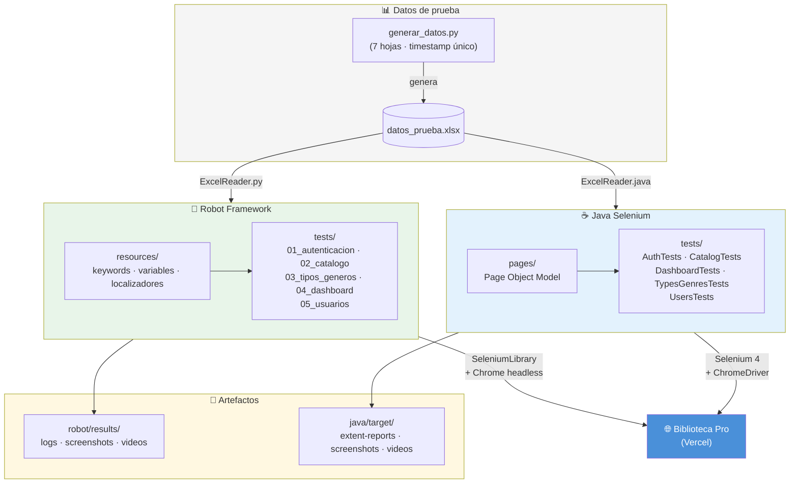
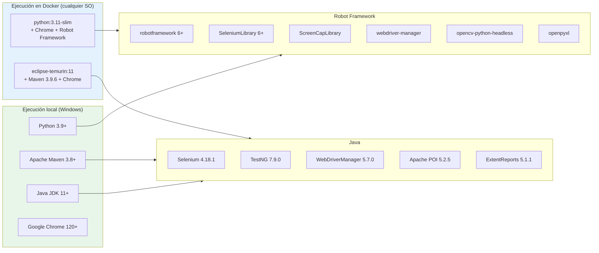
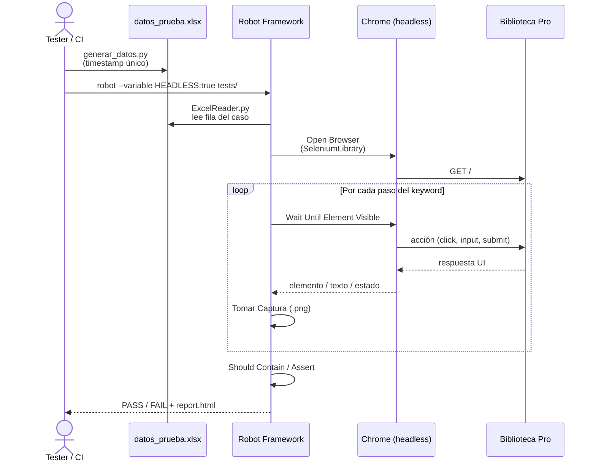
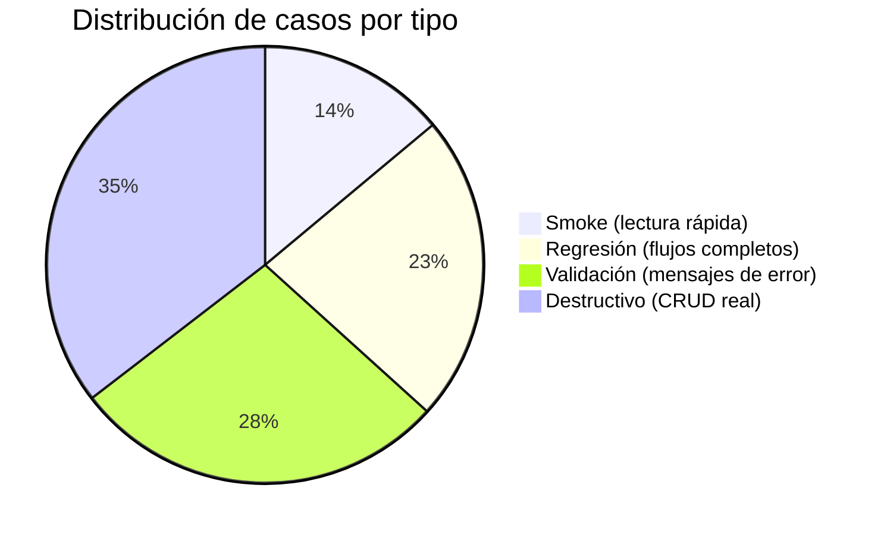
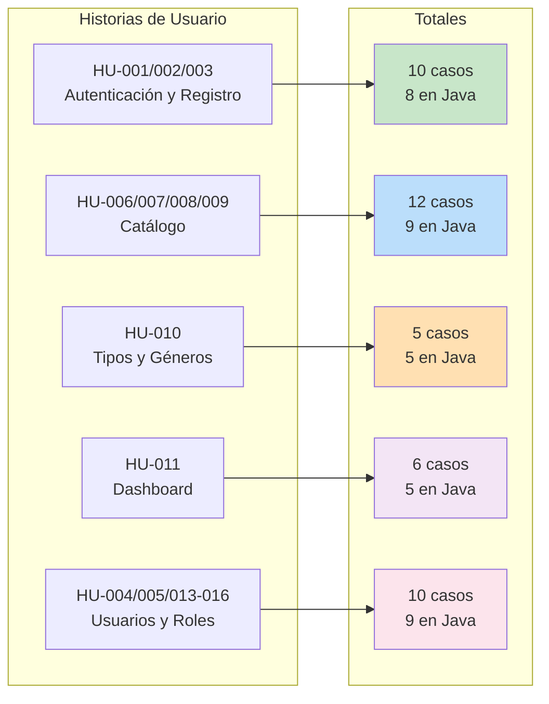
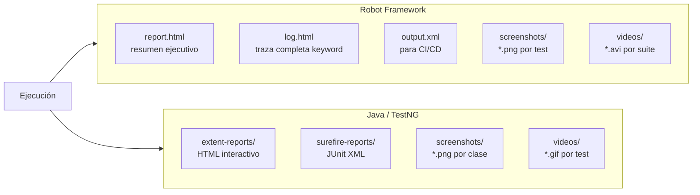

# Biblioteca Pro — Suite QA Automatizada

<div style="text-align: center;">
  
</div>

> Pruebas end-to-end automatizadas para la aplicación web **Biblioteca Pro**,
> implementadas con dos stacks complementarios y una interfaz gráfica de ejecución.

**Asignatura:** Pruebas y Gestión de la Configuración  
**Docente:** David Mejia Tabares

| Integrante | GitHub |
|---|---|
| Jeffrey Guerrero | [jguerreromira](https://github.com/jguerreromira) |
| Jhoan Londono | [jhoan636](https://github.com/jhoan636) |
| Estiven Uribe | [EstivenUribe](https://github.com/EstivenUribe) |

---

## Presentación del proyecto

<!-- ═══════════════════════════════════════════════════════════════
     IFRAME · Google Slides
     En GitHub el iframe no se renderiza; úsalo en GitLab,
     Notion, GitHub Pages o cualquier plataforma que acepte HTML.
     ═══════════════════════════════════════════════════════════════ -->


<a href="https://drive.google.com/file/d/1uuHhV9Mp4ZYYKz5314SNUxZHwf9t3Aau/preview" target="_blank">
  
</a>

---

## Tabla de contenidos

1. [¿Qué es este proyecto?](#qué-es-este-proyecto)
2. [Arquitectura general](#arquitectura-general)
3. [Interfaz gráfica](#interfaz-gráfica)
4. [Stack tecnológico](#stack-tecnológico)
5. [Flujo de ejecución de un test](#flujo-de-ejecución-de-un-test)
6. [Datos de prueba](#datos-de-prueba)
7. [Cómo ejecutar](#cómo-ejecutar)
   - [Docker (recomendado, cualquier equipo)](#-docker-recomendado)
   - [Robot Framework local](#robot-framework-local)
   - [Java / TestNG local](#java--testng-local)
   - [GUI Windows](#gui-windows)
8. [Cobertura de pruebas](#cobertura-de-pruebas)
9. [Artefactos y reportes](#artefactos-y-reportes)
10. [Limpieza](#limpieza)

---


## ¿Qué es este proyecto?

**Biblioteca Pro** es una SPA React para gestión de biblioteca.
Esta suite valida sus módulos principales con pruebas automatizadas de extremo a extremo.

| Característica | Robot Framework | Java Selenium |
|---|---|---|
| Paradigma | Keyword-driven | Page Object Model |
| Tests | **43 casos** | **36 casos** |
| Archivos | 5 `.robot` | 5 clases Java |
| Datos | Excel `.xlsx` | Excel `.xlsx` |
| Reporte | `report.html` + `log.html` | ExtentReports HTML |
| Video | `.avi` (XVID) | `.gif` |

Sitio bajo prueba: [`https://biblioteca-front-end-1satou1s-projects.vercel.app`](https://biblioteca-front-end-1satou1s-projects.vercel.app)

---

## Arquitectura general



---

## Interfaz gráfica

> Lanzador Tkinter para Windows — ejecuta ambas suites y muestra capturas en vivo.


**Funciones principales:**
- Botones de suite completa (Robot verde · Java azul)
- Botones de ejecución rápida headless (Robot naranja · Java morado)
- Consola con salida en tiempo real
- Visor de capturas actualizadas durante la ejecución
- Árbol de resultados recientes

---

## Stack tecnológico



---

## Flujo de ejecución de un test



---

## Datos de prueba

El script `generar_datos.py` produce un Excel con **7 hojas** y un timestamp Unix
único por ejecución — ninguna corrida contamina datos de otra.



| Hoja | Casos | Tipo predominante |
|---|:---:|---|
| Login | 5 | Smoke + Validación |
| Registro | 6 | Destructivo + Validación |
| Catalogo | 7 | Destructivo + Validación |
| TiposGeneros | 8 | Destructivo + Validación |
| Dashboard | 5 | Smoke + Validación |
| Usuarios | 4 | Smoke + Destructivo |
| Precondiciones | 9 | Referencia QA (no usada por tests) |

Estrategia anti-contaminación: todos los registros creados llevan prefijo
`QA_AUTO_` + timestamp, identificables y borrables sin afectar datos reales.

---

## Cómo ejecutar

### 🐳 Docker (recomendado)

Funciona en Windows, macOS y Linux sin instalar Python, Java ni Maven.
Solo se necesita **Docker Desktop**.

```bash
# Primera vez: construir imágenes (~5-10 min)
docker compose build

# Robot Framework — suite completa (43 tests)
docker compose run --rm robot

# Robot Framework — solo smoke (más rápido)
docker compose run --rm robot-smoke

# Java / TestNG — suite completa (36 tests)
docker compose run --rm java
```

Variantes con parámetros:

```bash
# Solo tests destructivos
docker compose run --rm -e TAGS=destructivo robot

# Una suite específica
docker compose run --rm -e SUITE=02_catalogo.robot robot

# Una clase Java
docker compose run --rm -e TEST_CLASS=AuthTests java
```

Los resultados quedan en la máquina host:

| Stack | Ruta |
|---|---|
| Robot Framework | `robot/results/` |
| Java / TestNG | `java/target/` |

---

### Robot Framework local

**Prerequisitos:** Python 3.9+, Google Chrome 120+.

```powershell
# 1. Instalar dependencias (solo la primera vez)
cd robot
python -m venv venv
venv\Scripts\activate
pip install -r requirements.txt

# 2. Generar datos de prueba
venv\Scripts\python.exe data\generar_datos.py

# 3. Ejecutar
cd ..
robot\run_tests.bat                              # suite completa, browser visible
set HEADLESS=true && robot\run_tests.bat         # sin ventana
set TAGS=smoke && robot\run_tests.bat            # solo smoke
set HEADLESS=true && set TAGS=smoke && robot\run_tests.bat
```

Variables de entorno disponibles:

| Variable | Default | Descripción |
|---|---|---|
| `HEADLESS` | `false` | `true` → Chrome sin ventana (`--headless=new`) |
| `RECORD_VIDEO` | `false` | `true` → graba `.avi` por suite |
| `SUITE` | _(todos)_ | ruta a `.robot` específico (ej. `tests\02_catalogo.robot`) |
| `TAGS` | _(todos)_ | filtro: `smoke`, `regresion`, `destructivo`, `validacion`, `HU-007`… |

Reportes en `robot/results/logs/report.html`.

---

### Java / TestNG local

**Prerequisitos:** Java JDK 11+, Apache Maven 3.8+, Google Chrome 120+.

```powershell
# Suite completa (browser visible)
java\run_tests.bat

# Headless (sin ventana)
set HEADLESS=true && java\run_tests.bat

# Una clase específica
set TEST=AuthTests && java\run_tests.bat

# Con Maven directamente
cd java
mvn test -Dheadless=true
mvn test "-Dtest=AuthTests#tc_lgn_001_loginExitosoAdmin"
```

Variables de entorno:

| Variable | Default | Descripción |
|---|---|---|
| `HEADLESS` | `false` | Activa `--headless=new` en ChromeOptions |
| `TEST` | _(suite completa)_ | Nombre de clase Java, ej. `CatalogTests` |

Reportes en `java/target/extent-reports/`.

---

### GUI Windows

```powershell
gui\launcher.bat
```

Abre el lanzador visual. No requiere configuración adicional si el entorno
Python (`robot/venv`) ya fue creado.

---

## Cobertura de pruebas



**Leyenda:** S=Smoke · R=Regresión · V=Validación · D=Destructivo

### Autenticación y Registro (HU-001 · HU-002 · HU-003)

| TC | Descripción | Robot | Java | Tipo | D |
|---|---|:---:|:---:|:---:|:---:|
| TC-LGN-001 | Login exitoso admin → Panel Principal | ✓ | ✓ | S | |
| TC-LGN-002 | Badge de rol visible tras login | ✓ | ✓ | R | |
| TC-LGN-003 | Botón deshabilitado con campos vacíos | ✓ | ✓ | V | |
| TC-LGN-004 | Toast de error con credenciales incorrectas | ✓ | ✓ | V | |
| TC-LGN-005 | Data-driven: admin, lector, erróneas, vacías | ✓ | ✓ | R | |
| TC-LGT-001 | Logout limpia localStorage, redirige a login | ✓ | ✓ | S | |
| TC-LGT-002 | Ruta protegida redirige sin sesión activa | ✓ | ✓ | R | |
| TC-REG-001 | Data-driven registro: éxito + errores validación | ✓ | ✓ | R | ✓ |
| TC-REG-002 | Cédula solo acepta caracteres numéricos | ✓ | — | V | |
| TC-REG-003 | Contraseña mínimo 6 caracteres | ✓ | — | V | |

### Catálogo (HU-006 · HU-007 · HU-008 · HU-009)

| TC | Descripción | Robot | Java | Tipo | D |
|---|---|:---:|:---:|:---:|:---:|
| TC-CAT-001 | Ver catálogo con skeletons de carga | ✓ | ✓ | S | |
| TC-CAT-002 | Búsqueda tiempo real filtra título y autor | ✓ | ✓ | R | |
| TC-CAT-003 | Búsqueda sin resultados muestra mensaje | ✓ | ✓ | V | |
| TC-CAT-004 | Data-driven crear libro (éxito + duplicado) | ✓ | ✓ | R | ✓ |
| TC-CAT-005 | Campos obligatorios vacíos muestran error | ✓ | ✓ | V | |
| TC-CAT-006 | Año no numérico muestra error de validación | ✓ | — | V | |
| TC-CAT-007 | Botón Crear muestra estado "Creando..." (UX) | ✓ | — | V | |
| TC-CAT-008 | Data-driven editar libro | ✓ | ✓ | R | ✓ |
| TC-CAT-009 | Libro en edición resaltado con borde verde | ✓ | —¹ | R | |
| TC-CAT-010 | Cancelar edición vuelve al formulario creación | ✓ | ✓¹ | R | |
| TC-CAT-011 | Eliminar libro: modal de confirmación aparece | ✓ | ✓ | S | |
| TC-CAT-012 | Cancelar eliminación no borra el libro | ✓ | ✓ | R | |

¹ Java usa TC-CAT-009 para el caso "Cancelar edición". El caso de resaltado visual no tiene equivalente en Java.

### Tipos y Géneros (HU-010)

| TC | Descripción | Robot | Java | Tipo | D |
|---|---|:---:|:---:|:---:|:---:|
| TC-TGN-001 | Data-driven agregar tipos y géneros | ✓ | ✓ | S* | ✓ |
| TC-TGN-002 | Campo vacío muestra error obligatorio | ✓ | ✓ | V | |
| TC-TGN-003 | Nombre duplicado case-insensitive muestra error | ✓ | ✓ | V | ✓ |
| TC-TGN-004 | Editar tipo existente y actualizar | ✓ | ✓ | R | ✓ |
| TC-TGN-005 | Eliminar tipo requiere confirmación modal | ✓ | ✓ | R | ✓ |

\* TC-TGN-001 está etiquetado `smoke` pero crea datos en el ambiente.

### Dashboard y Estadísticas (HU-011)

| TC | Descripción | Robot | Java | Tipo | D |
|---|---|:---:|:---:|:---:|:---:|
| TC-DSH-001 | Dashboard accesible para admin | ✓ | ✓ | S | |
| TC-DSH-002 | Data-driven generar gráfico con 4 filtros | ✓ | ✓ | R | |
| TC-DSH-003 | Generar sin filtro muestra advertencia | ✓ | ✓ | V | |
| TC-DSH-004 | Botón Sincronizar manual ejecuta sincronización | ✓ | ✓ | R | |
| TC-DSH-005 | Botón Generar se deshabilita durante operación | ✓ | ✓ | V | |
| TC-DSH-006 | Botón muestra "Sincronizando..." durante operación | ✓ | — | V | |

### Usuarios y Roles (HU-004 · HU-005 · HU-013–016)

| TC | Descripción | Robot | Java | Tipo | D |
|---|---|:---:|:---:|:---:|:---:|
| TC-USR-001 | Solo admin accede a pantalla de usuarios | ✓ | ✓ | S | |
| TC-USR-002 | Lista muestra datos completos y badge de rol | ✓ | ✓ | R | |
| TC-USR-003 | Skeletons animados durante carga | ✓ | —² | V | |
| TC-USR-004 | Panel admin muestra tarjetas Usuarios y Redis | ✓ | ✓² | R | |
| TC-USR-005 | Data-driven editar rol de usuario | ✓ | ✓ | R | ✓ |
| TC-USR-006 | Edición inline, sin modal flotante | ✓ | ✓ | V | |
| TC-USR-007 | Contraseña vacía en edición no modifica | ✓ | ✓ | V | |
| TC-USR-008 | Eliminar usuario: modal aparece, se cancela | ✓ | ✓ | R | |
| TC-USR-009 | Solo admin ve tarjeta Redis | ✓ | ✓ | R | |
| TC-USR-010 | Limpiar Redis pide confirmación y muestra conteo | ✓ | ✓ | R | ✓ |

² Java usa TC-USR-003 para el caso "Panel admin". El caso de skeletons no tiene equivalente en Java.

### Resumen

| Módulo | Robot | Java | Únicos |
|---|:---:|:---:|:---:|
| Autenticación y Registro | 10 | 8 | 10 |
| Catálogo | 12 | 9 | 12 |
| Tipos y Géneros | 5 | 5 | 5 |
| Dashboard | 6 | 5 | 6 |
| Usuarios y Roles | 10 | 9 | 10 |
| **Total** | **43** | **36** | **43** |

---

## Artefactos y reportes



| Artefacto | Robot | Java |
|---|---|---|
| Reporte principal | `robot/results/logs/report.html` | `java/target/extent-reports/` |
| Log detallado | `robot/results/logs/log.html` | `java/target/surefire-reports/` |
| Capturas | `robot/results/screenshots/` | `java/target/screenshots/` |
| Video | `robot/results/videos/*.avi` | `java/target/videos/*.gif` |

---

## Limpieza

```powershell
# Windows
clean.bat

# Linux / macOS / Docker host
bash clean.sh
```

Borra resultados, `java/target/` y cachés Python. **No toca** el código fuente ni el entorno virtual.

Para regenerar el Excel después de limpiar:

```powershell
robot\venv\Scripts\python.exe robot\data\generar_datos.py
Copy-Item robot\data\datos_prueba.xlsx java\src\test\resources\datos_prueba.xlsx -Force
```

---

## Estructura del proyecto

```text
test-roboframework/
├── .dockerignore
├── .gitattributes
├── .gitignore
├── clean.bat / clean.sh          ← limpieza de artefactos
├── docker-compose.yml            ← servicios robot · robot-smoke · java
│
├── docker/
│   ├── Dockerfile.robot          ← Python 3.11 + Chrome + Robot Framework
│   ├── Dockerfile.java           ← multi-stage: Excel → Maven + JDK 11 + Chrome
│   ├── entrypoint-robot.sh
│   └── entrypoint-java.sh
│
├── gui/
│   ├── launcher.bat              ← abre la GUI (Windows)
│   └── launcher.py              ← interfaz tkinter
│
├── robot/
│   ├── requirements.txt
│   ├── run_tests.bat / .sh
│   ├── data/
│   │   ├── generar_datos.py      ← genera Excel con timestamp único
│   │   └── datos_prueba.xlsx     ← generado, no versionado
│   ├── resources/
│   │   ├── variables.robot       ← URL, credenciales, localizadores
│   │   ├── keywords_comunes.robot
│   │   ├── ExcelReader.py
│   │   └── VideoRecorder.py      ← grabación XVID/AVI (reemplaza ScreenCapLibrary)
│   ├── tests/
│   │   ├── 01_autenticacion.robot
│   │   ├── 02_catalogo.robot
│   │   ├── 03_tipos_generos.robot
│   │   ├── 04_dashboard.robot
│   │   └── 05_usuarios.robot
│   └── results/                  ← generado, no versionado
│
└── java/
    ├── pom.xml
    ├── testng.xml
    ├── testng-headless.xml
    ├── run_tests.bat / .sh
    └── src/
        ├── main/java/com/biblioteca/
        │   ├── config/Config.java
        │   └── pages/             ← Page Objects
        └── test/java/com/biblioteca/
            ├── base/BaseTest.java
            ├── tests/             ← AuthTests · CatalogTests · DashboardTests
            │                         TypesGenresTests · UsersTests
            └── utils/             ← ExcelReader · ScreenshotUtils · VideoRecorder
```
